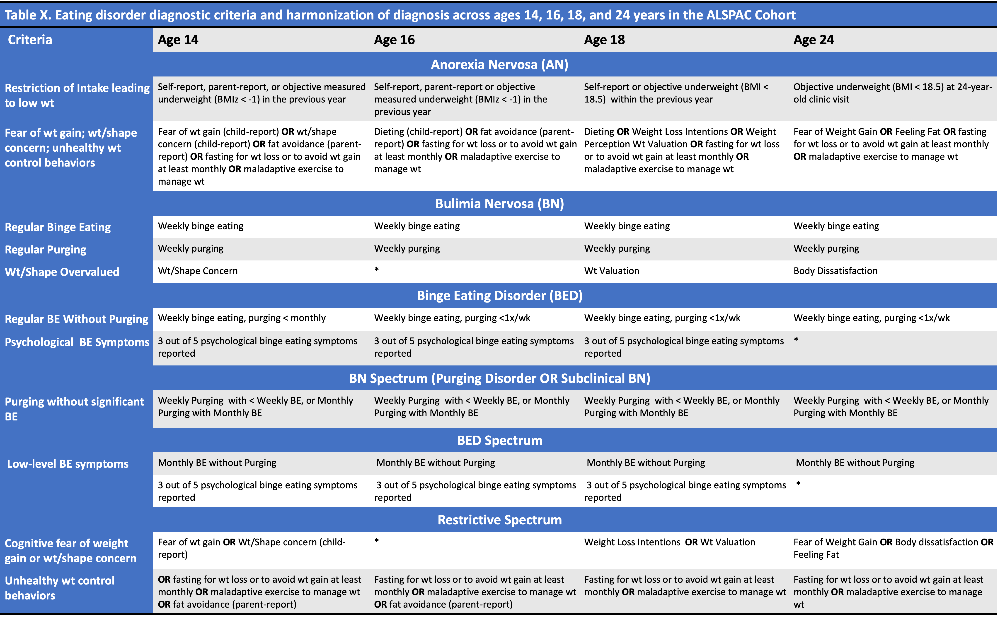

## Measures

### Socioeconomic Status (SES)

Measures of parent occupation were obtained for both mother and partner during child gestation. Parental occupations were then classified as unskilled(0), partly skilled (1), skilled manual (2), skilled non-manual (3), manegerial and technical (4), or professional (5). Of reported parent occupations, the highest reported occupation was used as a proxy for parent SES, to be treated as a continuous (0-5) covariate in analyses.

### Body Mass Index

Objective body mass index (BMI) was collected at face-to-face assessment (median ages: xx, 13.8, 15.5, 17.8, and 24.0) and self- or parent-report (median ages xx, xxx, xx, xx, xx. ). To maximize accuracy and minimize missing data, data from objective and self-report were integrated at ages 10, 14, 16, and 18 reflecting BMI assessments in the prior year, such that objective BMIz was used, if available, and self- or parent-report BMIz was used if objective data was not available (see Table \@ref(tab:bmi) for available data across timepoints). BMIz at age 10 was used as an analytic covariate and BMI/BMIz at later ages was used as a diagnostic criteria for AN (see more information in Table \@ref(tab:y) below). At ages 14-18, an underweight assignment was determined using age and gender BMIz score of \< -2 using World Health Organization (WHO) reference data and corresponding to grade 1 thinness [@coleBodyMassIndex2007]; at Age 24 underweight was assigned as BMI \< 18.5.

```{r bmi, include = FALSE}
# clinic <- sum(!is.na(demo_ed.f$bmi_clinic.13))
# no_clinic <- sum(is.na(demo_ed.f$bmi_clinic.13))
# best_avail <- sum(!is.na(demo_ed.f$bmi_bestavail.13))
# 
# missing_n <- 7688- best_avail
# pr_n <- best_avail-clinic
# missing_percent <- round ((7688 - best_avail)/7688*100 , 2)
# clinic_percent <-  round ((clinic)/7688*100, 2)
# pr_percent <- round((best_avail-clinic)/7688*100, 2)

```

### Cognitive Eating Disorder Features

Cognitive f

| Construct                   | Age        | Description                                                                                                                                                                                                                           |
|:---------------|:---------------|:---------------------------------------|
| Thin ideal internalization  | 14         | Measured via the Ideal Body Stereotype Scale-Revised. Adolescents responded to statements regarding appearance ideals rated on a 5-point Likert scale from 'strongly agree' to 'strongly disagree.'                                   |
| Pressure to Lose Weight     | 14         | Assessed via the Perceived Sociocultural Pressure Scale. Pressure to lose weight from friends, family, romantic partners, and the media .                                                                                             |
| Pressure to Increase Muscle | 14         | Assessed via the Perceived Sociocultural Pressure Scale. Pressure to gain muscle from friends, family, romantic partners, and the media.                                                                                              |
| Weight-related Teasing      | .          | Adolescents reported weight related teasing from peers and family members with five possible responses ranging from "never" to "at least once a week."                                                                                |
| External Eating             | 14         | Assessed via the Dutch Eating Behavior Questionnaire (DEBQ)                                                                                                                                                                           |
| Restrained Eating           | 14         | Assessed via the Dutch Eating Behavior Questionnaire (DEBQ)                                                                                                                                                                           |
| Emotional Eating            | 14         | Assessed via the Dutch Eating Behavior Questionnaire (DEBQ)                                                                                                                                                                           |
| Weight/Shape Concern        | 14         | Weight and shape concern at age 14 was assessed using a 4 item questionnaire adapted from the McKnight Risk Factor Survey.                                                                                                            |
| Body Dissatisfaction        | 14, 18, 24 | The Body (dis)Satisfaction Scale asked individuals to rate their satisfaction with body parts on a 5-point Likert scale, from 'extremely satisfied' to 'extremely dissatisfied' with higher values indicating higher dissatisfaction. |
| Dieting                     | 14, 16, 18 | Participant dieting was measured at age 14, 16, and 18 and measured frequency during the past year YP went on a diet to lose weight/keep from gaining weight, length of diet, amount of weight lost, and amount of weight regained.   |
| Fear of Weight Gain         | 14, 24     | Participants reported the degree they worried about gaining a little weight (two pounds) in the past year.                                                                                                                            |
| Weight intentions           | 14, 18     | Participants reported what they are trying to do with their weight.                                                                                                                                                                   |
| Weight Perception           | 14, 18     | Participants reported their perception of their weight.                                                                                                                                                                               |
| Weight Valuation            | 18         | Participants reported the degree to which their weight has made a difference to how they feel about themselves.                                                                                                                       |
| Feeling Fat                 | 24         | Participant reported the frequency that they have felt fat in the past year.                                                                                                                                                          |


### Eating Disorder Behaviors

The measurement of eating disorder behaviors in adolescence captures a more complete range of behaviors beyond ED diagnosis. Eating disorder behaviors were assessed through questionnaires developed from the Youth Risk Behavior Surveillance System (YRBSS)[@kannYouthRiskBehavior1995] at Waves 14+, 16+, 18+, and 24+ years. Participants were asked to consider the past year in their responses. 

### Maladaptive Exercise

At ages 14, 16, and 18 years, participants were asked if they exercised to lose weight or avoid gaining weight, with response options of: No(0), Yes-Sometimes(1), and Yes-Frequently(2). At age 24, participants were asked the frequency with which they exercised to lose weight or avoid gaining weight, with response options of: Never, \<1x/mo, 1-3x/mo, 1-4x/wk, and 5 or more times per week. Responses at age 24 were harmonized with age 14, 16, and 18. Responses of Never were binned as "No" (0); 1x/mo - \<1x/week were binned as 'Yes - Sometimes'(1), and 1x/wk or more as 'Yes - Frequently'(2). Once a week or more was chosen as the threshold for 'frequent' exercise for weight loss at age 24 to align with DSM-5 diagnostic frequency thresholds for other eating disorder behaviors [@americanpsychiatricassociationDiagnosticStatisticalManual2013]. The primary outcome variable of analysis for exercise for weight loss is an ordinal variable, defined as 0 = No, 1 = Sometimes, and 2 = Frequently.

#### Maladaptive Exercise

At all assessment points, participants reported whether exercise interferes with work/school (14,16,18), or their daily routine (24). At ages 14 and 24, participants also reported whether they exercised to lose weight even when sick or injured. At ages 16 and 18 years, participants also reported whether they felt guilty about missing an exercise session. Responses options for exercise issues were 'No', 'yes - Sometimes', or 'Yes - Frequently'. Maladaptive exercise is defined in accordance with scoring methods in @schaumbergPatternsMaladaptiveExercise2022, which includes exercising for weight loss **sometimes or frequently** and at least one **maladpative exercise indicator** defined as present at each time point. 


### Physical Activity

#### Accelerometers

Physical activity data was captured using the Actigraph^tm^ accelerometer, which is often used in child physical activity studies. Participants were instructed to wear accelerometers around the waist just above their right hip for the duration of the tracking period. Accelerometer data was collected at the following four time points. At ages 11.5, 13.5, and 15.5, during a clinic visit, young people were asked to wear the accelerometer for 7 days, beginning the day after clinic attendance [@mattocksUseAccelerometersLarge2008]. At age 24 participants were asked to wear accelerometers for four days beginning the day after clinic attendance [@troianoPhysicalActivityUnited2008].

#### CPM

Accelerometer data was used to extract total physical activity which was measured as the total counts per minute (CPM) over the period of valid recording. Associations with total physical activity are usually calculated per 100 cpm as this difference is of a similar order to the differences observed between males and females in these data.

#### MVPA

Moderate to Vigerous Physical Activity (MVPA) measures the average amount of time spent above a CPM cutoff, these cutoff points differ by age groups. At ages 11.5, 13.5 and 15.5 A value of \>= 3600 cpm was originally used to define MVPA at the time of the data collection [@mattocksUseAccelerometersLarge2008]. More recently, following Evenson et. al. [@evensonCalibrationTwoObjective2008], who calculated a lower cutpoint of \>=2296. Both sets of data were included in analysis. At age 24 MVPA cutoff was established at \>2020 cpm [@troianoPhysicalActivityUnited2008].

#### Valid Days

Valid Days are calculated using a cutoff of minutes per day that an accelerometer was worn. For ages 11.5-15.5 a cutoff of \>=600 minutes per day was used. At age 24 Valid Days were operationalised as a wear time of at least 500 minutes, after excluding intervals of \>60 minutes with zero counts.

### Eating Disorder Diagnoses

Eating disorder diagnoses (AN, BN,BED, BN-Spectrum [Purging disorder and subclinical BN], BED-spectrum [subclinical BED], and Restrictive spectrum [ED cognitions and restrictive ED behaviors in the absence of regular binge eating, purging, or low weight]) were derived at each age using best available measures and following steps outlined in @micaliAdolescentEatingDisorders2015, with minor changes (low-weight was defined as BMIZ \< -1.0 at ages 14 and 16 years; additional cognitive measures added to criteria as available; subclinical and OSFED categories collapsed to reflect BN, BED, and Restrictive Spectrum ED pathology). Scoring algorithms reflect DSM-5 criteria aligned as well as possible with available data that can be harmonized across assessment points [@americanpsychiatricassociationDiagnosticStatisticalManual2013]. While the majority of ED cognitions and behaviors are self-reported, parent-report of restrictive eating was included as an indicator at ages 14 and 16 years as adolescents tend to under-report AN symptoms [@houseDiagnosingEatingDisorders2008]. Table X shows the full criteria used for each diagnosis.

Diagnoses were assessed at Waves14+, 16+, 18+, and 24+. Excessive exercise, which is used as criteria for an AN and OSFED diagnoses, was assigned to the adolescent if they found themselves lacking time to do schoolwork due to engaging in exercise, exercising when sick or injured, and feeling guilt when unable to exercise.

```{r alspac_dx_table, fig.cap= 'Diagnostic Criteria Assessed Across Age'}

```
