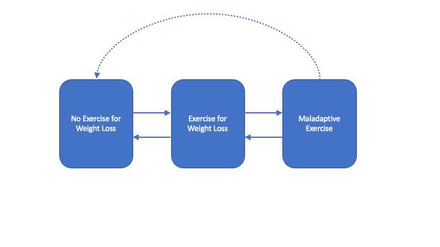

--- 
title: "Associations between Physical Activity Trajectories in Childhood and Driven Exercise in Adolescence in the ALSPAC Cohort"
shorttitle: 'ALSPAC PA Trajectories'
author: 
- name: "Katherine Schaumberg"
  affiliation : '1'
  corresponding: yes
  address: '6001 Research Park Blvd, Madison, WI, USA, 53719'
  role: 
  - Conceptualization
  - Writing - Original Draft Preparation 
  - Writing - Review & Editing
date: "`r Sys.Date()`"
documentclass: 'apa6'
site: bookdown::bookdown_site
bibliography: [PA_trajectories.bib, packages.bib]
biblio-style: apa
link-citations: yes
github-repo: kschaumb/alspac-dex-bookdown
description: "This is a bookdown for ALSPAC Longitudinal DEx analyses"
resource_files: 
 -data/ed_data.RData
 -R/05-01-histogram-functions.R
 -R/06-02-transition-plot.R
output: bookdown::gitbook

---

```{r setup, include=FALSE}
knitr::opts_chunk$set(echo = FALSE, message = FALSE, warning = FALSE)

library(dplyr)
library(wesanderson)
library(ordinal)
library(tidyr)
library(tibble)
library(ggplot2)
library(haven)
library(usethis)
library(stringr)
library(ggalluvial)
library(ggthemes)
library(rlang)
library(viridis)
library(lme4)
library(flexplot)
library(jtools)
library(docxtools)
library(msm)
library(mice)
library(datawizard)
library(miceadds)
library(purrr)
library(labelled)
library(broom.mixed)
library(mitml)
library(kableExtra)
source("R/05-01-histogram-functions.R", local = knitr::knit_global())
source("R/06-02-transition-plot.R", local = knitr::knit_global())

```

max was here
lauren was here <3
This is the introduction to the Physical Activites trajectory paper. 

Katherine is making a citation here [@schaumbergAnxietyDisorderSymptoms2018]

<!--chapter:end:index.Rmd-->


# Introduction

Placeholder


## Current Study
## Study Aims {#aims}

<!--chapter:end:01-Introduction.Rmd-->


# Method

Placeholder


## Sample - The ALSPAC Cohort

<!--chapter:end:02-Method_Sample.Rmd-->


## Measures
### Socioeconomic Status (SES)
### Eating Disorder Cognitions
#### Body Dissatisfaction
#### Thin-ideal Internalization
#### Fear of Weight Gain
### Body Mass Index Z-score (BMI-Z) at Age 13
### Exercise Measures
#### Exercise for Weight Loss
#### Maladaptive Exercise
#### Exercise Gropus

<!--chapter:end:03-Method_Measures.Rmd-->


# Analytic Plan

Analyses will be gender stratified. The primary predictor variable of interest is time, with the purpose of investigating persistence and changes in exercise behavior over adolescent and young adult development. Secondary predictors include: BMI-Z score at age 13 and Eating Disorder Cognitions at Age 14. Parent SES will be entered as a covariate as it is possible, though not hypothesized, that exercise patterns may vary based on socioeconomic status. 

## Multi-State Transition Analyses

The first step in analyses will evaluate overall changes in the presence of exercise for weight loss and maladaptive exercise over time in the sample. Visualization will be completed with transition plots [@cernatVisualizingTransitionsTime2021] for those completing all four assessment points. For those completing at least two assessment points, transition analysis will include multi-state Markov models for panel data [@jacksonMultistateModellingMsm], the implementation of which on the current data will describe how individuals move between the 'No Exercise for Weight Loss', 'Exercise for Weight Loss', and 'Maladaptive Exercise' groups over time, with transition intensities representing the instantaneous risk of moving between these three groups. An initial transition matrix will be specified in which instantaneous transitions between adjacent states are permitted, as well as transitions between the Maladaptive Exercise-No Exercise for Weight Loss state (direct transition to exercise abstinence). If initial models do not converge, direct transitions from Maladaptive Ex to No-Exercise for Weight Loss will also be constrained to 0, such that a sojurn through the Exercise for Weight Loss state is required (See \@ref(fig:transfig)) Transition analyses will be completed separately for boys and girls, and the fitted transition probability matrix, $P(t)$ will be reported over an interval of 1-year, which will describe the liklihood of transition between exercise groups in a given year during the study time frame. Exploratory analysis of transition states will examine whether baseline covariates (Parent SES, BMI-Z at age 13 years, eating disorder cognitions at age 14 years) impact transition intensities amongst the three exercise groups.  

```{r transfig, fig.cap = 'Transitions between Exercise Groups', out.width= '90%'}

```


## Missing Data

Prior to mixed-effects modeling, missing data was imputed using the `mice` and `miceadds` packages [@R-mice; @R-miceadds]. Imputed variables and imputation approach for each variable is noted in Supplemental Table \@ref(tab:imptab). Time-invariant variables were imputed at level-2 only using a Predictive Mean Matching (PMM) approach, and outcome variables were imputed using 2-level approaches, which consider time. Datasets for girls and boys are imputed separately, with 20 imputed datasets. In addition to covariate and predictor variables, parent education was also included in the imputation model specifically to improve imputation of highest parent occupation (measure of SES).

## Mixed Effects Modeling

Mixed Effects Models for ordinal and binary data [@christensenAnalysisOrdinalData2015; @christensenTutorialFittingCumulative2019; @landermanModelingRepeatedMeasures2011]  examine whether levels of exercise for weight loss and maladaptive exercise change across age. Parameter pooling was utilized to combine models fit to the imputed datasets.

Nested models allow for a random intercept for each individual, then a fixed effect of Time (assessment point - with baseline set to 14 years), followed by fixed effects for all baseline predictors and covariates, and, finally, all Predictor x Time interactions. Models were compared via the multivariate Wald test, using the D1 statistic [@buurenMiceMultivariateImputation2011]. Parameters for each model are presented in Supplement (Chapter \@ref(supp1) ). 


<!--chapter:end:04-Analytic_Plan.Rmd-->


# Results

Placeholder


## Descriptives
### Covariates: SES, BMIZ at Age 13, ED Cognitions at age 14
### Exercise for Weight Loss Frequency
### Exercise Issues Frequency
### Exercise Groups

<!--chapter:end:05-Descriptives.Rmd-->


## Transitions in Exercise Groups Over Time
### Girls
### Boys

<!--chapter:end:06-Transitions.Rmd-->

## Imputation

As stated in the analytic plan, data was imputed prior to conducting mixed effects models, with 10 iterations on 20 imputed datasets  The predictor matrix is presented in Supplemental Table \@ref(tab:predmat) ; the percent missing for each variable prior to imputation is presented in Supplemental Table \@ref(tab:pobs-girls) for girls and Supplemental Table \@ref(tab:pobs-boys) for boys, along with the influx (overall number of variable pairs \((Y_j,Y_k)\) with \(Y_j\) missing and \(Y_k\) observed, divided by the total number of observed data cells), and outflux (the number of variable pairs with \(Y_j\) observed and \(Y_k\) missing, divided by the total number of incomplete data cells) for each variable. The influx refers to connection to the observed data (ease of imputation, with one representing the highest level of connection to the observed data) the outflux refers to potential contribution to this variable in imputing other data, both on a 0-1 scale with one representing the highest possible levels of influx/outflux. Overall, there was moderate levels of missingness in the current data.

<!--chapter:end:07-Imputation.Rmd-->


## Mixed Effects Models - Maladaptive Exercise over Time
### Girls
### Boys

<!--chapter:end:08-mixed-effects-dex.Rmd-->


## Mixed-Effect Models - Exercise for Weight Loss
### Girls
### Boys

<!--chapter:end:09-mixed-effects-EWL.Rmd-->


# Discussion

Placeholder


## Transitions Across Exercise Groups
## Rates of Exercise for Weight Loss and Maladaptive Exercise over Time 
## Predictors of Maladaptive Exercise
### Eating Disorder Cognitions
### Age 13 BMI
## Limitations 
### Data harmonization across age
### Assessment gap between 18-24 years
### Model Convergence for Transition Models
### Snapshot of Anglo-Western Culture
## Future Directions
## Conclusions

<!--chapter:end:10-discussion.Rmd-->


# Supplement 1 - Mixed Models {#supp1}

Placeholder


<!--chapter:end:11-Supplement_1.Rmd-->


# Supplemental Figures

Placeholder


<!--chapter:end:12-Supplemental_Figures.Rmd-->


# Supplemental Tables

Placeholder


<!--chapter:end:13-Supplemental_Tables.Rmd-->


# References {-}

```{r include=FALSE}
# automatically create a bib database for R packages
knitr::write_bib(c(
  .packages(), 'bookdown', 'knitr', 'rmarkdown'
), 'packages.bib')
```


`r if (knitr:::is_html_output()) '

'`

<!--chapter:end:14-References.Rmd-->

